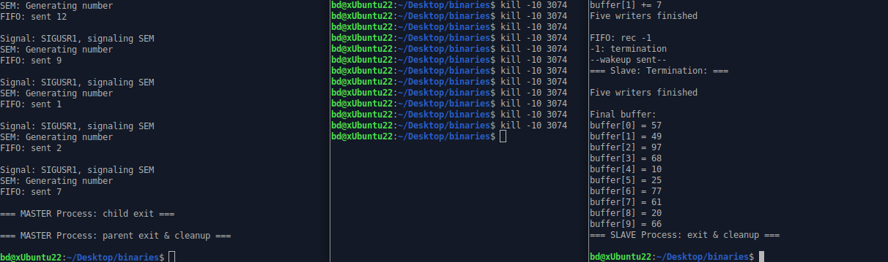
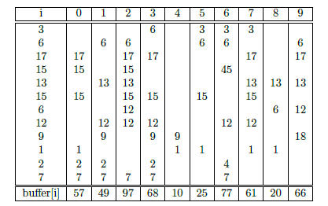
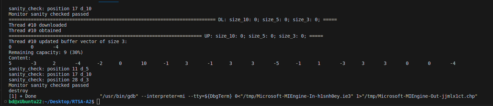

# Sync Assignments: Master-Slave Writers, MatOps

### Master-Slave Writers

Usage of sync mechanisms to ensure proper and sequential execution of threads on the example of simple master-slave write application. The master process waits for the signal from the user thorugh the terminal, whenever the signal is received, the random integer is sent to slave process. 
 
The slave manages a buffer of 10 integers initiated at zero, and has 5 threads. Whenever signal is received, 5 threads are activated and perofrms and additions rnadom integer to the random location of the buffer. 
 
The process repeats until the total sum of the generated integers by master exceeds 100. 
 
Testing on the random seed and calculating by hands gives proper result

 

### MatOps

Another sync problem on performing matrix multiplication with uploading and downloading the vectors from common buffer. Each thread operates cyclically, fetching vectors of sizes k = 3, 5, and 10 from the buffer, performing operations, and storing results back into the buffer. 
 
The solution also includes the implementation of proper synchronization techniques as well as queuing mechanisms depending on the vector size: FCFS (First Come-First Served), LVF (Longest Vectors First), SV (Shortest Vectors First). 

 
1. vectorop.c: the main runner file that includes main functions: monitor API, thread runners 
2. vectorop-utils.h: includes the functions for vector operations 

